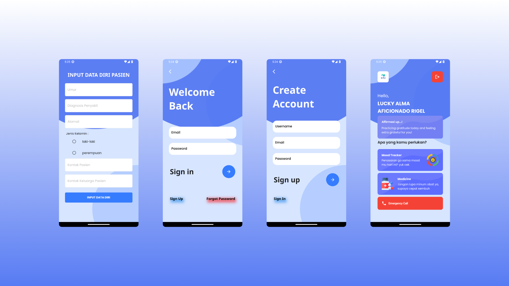
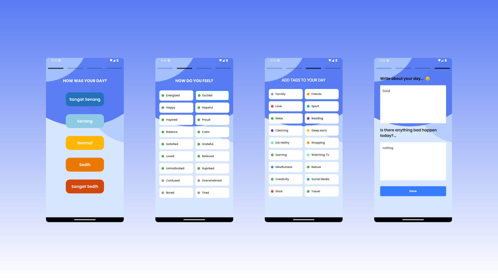
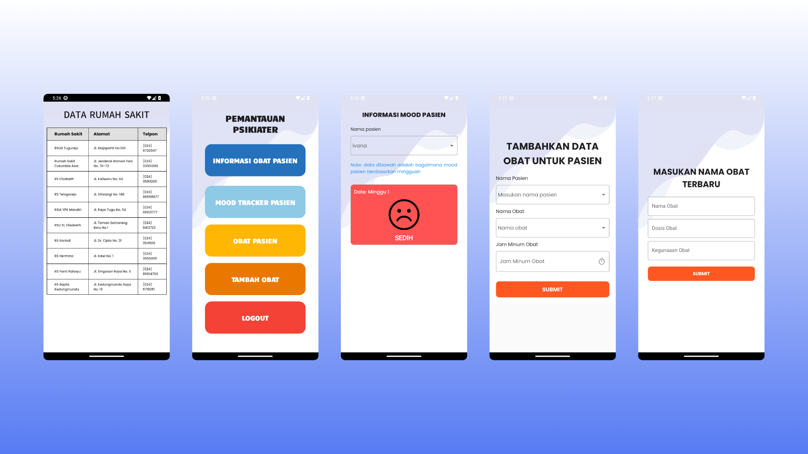

<<<<<<< HEAD
# ModMeed - Mood Medicine 🌈💊

ModMeed, singkatan dari "Mood Medicine," adalah aplikasi revolusioner yang memadukan manajemen mood dan pengingat minum obat. Dengan fitur-fitur canggih, ModMeed membantu Anda memantau mood Anda, memberikan rekomendasi obat, dan menjaga kesehatan mental Anda.

## Fitur Utama:

### 1. Autentikasi Firebase
- ModMeed menggunakan Firebase Authentication untuk login dan registrasi aplikasi, memberikan keamanan tingkat tinggi.

### 2. Penyimpanan Berkas Firebase
- Firebase Storage digunakan untuk menyimpan beberapa file, memungkinkan penyimpanan informasi terkait kesehatan dan mood.

### 3. Penilaian Mood
- ModMeed memungkinkan pengguna menilai mood mereka dengan mengisi beberapa pertanyaan. Setiap minggu, mood akan disimpulkan menjadi satu kesimpulan.

### 4. Pemantauan oleh Ahli
- Jika mood dirasa kurang sehat, ahli kesehatan dapat memantau dan memberikan rekomendasi obat berdasarkan pelacakan mood selama satu minggu.

### 5. Manajemen Obat
- Psikolog dapat menambahkan dan memberikan obat, serta menjadwalkan pengingat minum obat untuk memastikan kepatuhan pengguna.

### 6. Local Push Notification
- Menggunakan flutter pub.dev Local Push Notification untuk memberikan notifikasi tepat waktu, memperingatkan pengguna tentang jadwal minum obat atau peringatan mood.

### 7. Otomatis Berhenti Notifikasi
- Notifikasi pengingat berhenti secara otomatis setelah pengguna mengonsumsi obat, memastikan ketepatan dan kenyamanan.

### 8. Riwayat Minum Obat dan Mood
- ModMeed menyimpan riwayat minum obat dengan detail informasi obat dan mood, memberikan pandangan menyeluruh tentang kesehatan mental dan kepatuhan terhadap pengobatan.

## Screenshots Aplikasi

Dengan ModMeed, jaga kesehatan mental Anda dengan lebih baik. Pantau mood Anda, dapatkan rekomendasi obat, dan jadwalkan pengingat minum obat. Lihat tangkapan layar aplikasi di folder `assets/screenshots/` dan temukan solusi kesehatan terintegrasi dalam satu aplikasi! 💖💊
=======
**MoodMed - Aplikasi Pengingat Minum Obat dan Pengecekan Mood Harian**

MoodMed adalah aplikasi yang bertujuan membantu pengguna dalam menjaga kesehatan mental dan fisik. Dibangun dengan menggunakan Flutter, Firebase, GetX, dan CLI sebagai pola kode.

### Fitur Utama
1. **Pengingat Minum Obat:**
   - Pengguna dapat menetapkan jadwal minum obat mereka.
   - Notifikasi akan diirimkan untuk mengingatkan pengguna pada waktu yang ditentukan.

2. **Pengecekan Mood Harian:**
   - Pengguna dapat memasukkan penilaian terhadap mood mereka setiap harinya.
   - Data mood disimpan dalam database Firebase untuk analisis jangka panjang.

3. **Affirmasi Positif Harian:**
   - Setiap hari, pengguna akan menerima afirmasi positif secara acak untuk meningkatkan semangat dan kesejahteraan.

### Penggunaan
1. Pastikan telah menginstal Flutter dan Firebase di lingkungan pengembangan Anda.
2. Konfigurasikan Firebase dengan menambahkan file `google-services.json`.
3. Gunakan CLI untuk menjalankan perintah seperti pembuatan file baru atau manajemen dependensi.

### Struktur Proyek
- `lib/`: Kode sumber Flutter.
- `cli/`: Direktori berisi perintah CLI untuk pengelolaan proyek.
- `assets/`: Asset seperti gambar atau font.

### Cara Menjalankan Aplikasi
1. Buka terminal dan arahkan ke direktori proyek.
2. Jalankan perintah `flutter run` untuk menjalankan aplikasi.

### Kontribusi
Anda dapat berkontribusi melalui *pull request* dan melaporkan *issue*.

### Lisensi
Proyek ini dilisensikan di bawah MIT License - lihat file [LICENSE](LICENSE) untuk detailnya.
>>>>>>> 56c9530e466f13b54d30258a00fa467aaa42a451
